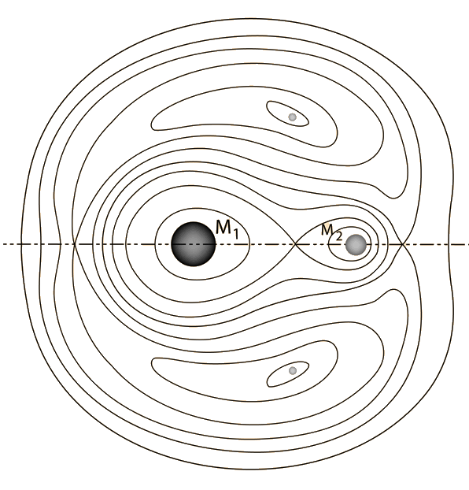

Space, Gravitation and Orbit
==============================================

## Skeleton Note

### Potentials and Stable Orbits

The Earth-Moon system produces such a equipotential

As gravitation from Sun is considered, only certain orbits are actually stable even at L4, and L5.
