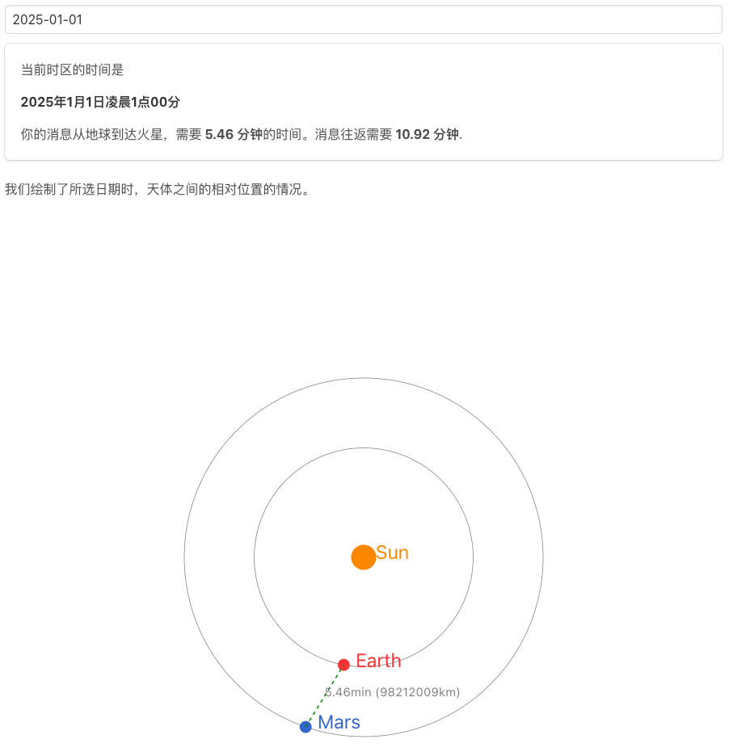
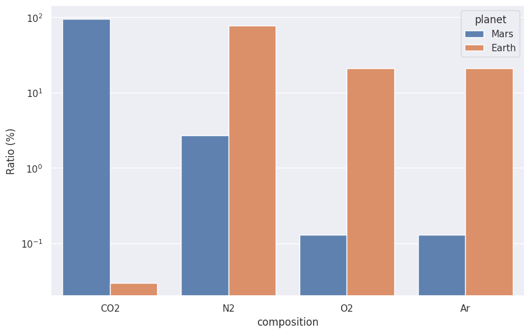
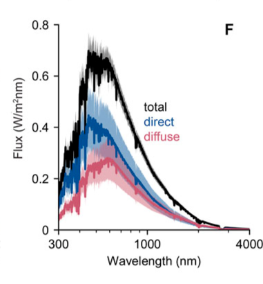
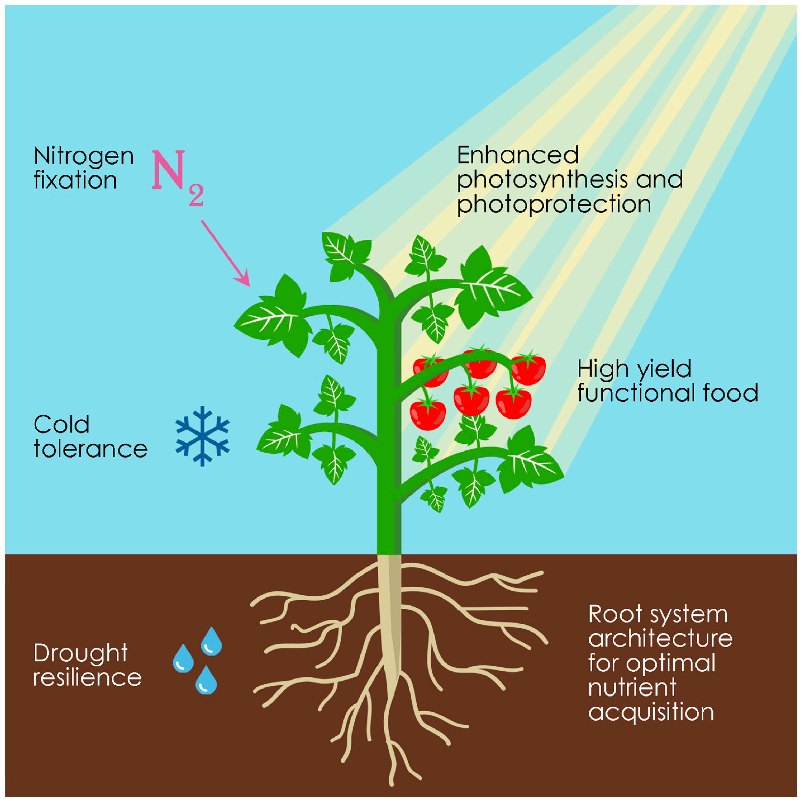

# 火星与地球

## 火星在哪里

=== "工具链接"

    星际移民中心开发的在线工具：https://interimm.org/comms-latency/

=== "Demo"

    可以查看，在任意时刻，地球和火星的相对位置。
    

## 基本知识

火星和地球星球特征[^earth-wiki][^mars-wiki]:

|                      |     地球      |            火星            |
| :------------------: | :-----------: | :------------------------: |
|         半径         |    6371km     | 3390km (0.53 Earth radius) |
|         引力         | 1g (9.8m/s^2) |      0.38g (3.7m/s^2)      |
| 太阳日 （solar day） |      24h      |        24h 39m 35s         |
|         公转         | 1y (365.25d)  |   1.8809y (1y 320d 18h)    |

火星和地球表面[^earth-wiki][^mars-wiki]：

|          |      地球      |                                      火星                                       |
| :------: | :------------: | :-----------------------------------------------------------------------------: |
|   温度   | −89 °C - 55 °C |                                 −110 °C - 35 °C                                 |
|   声速   |    ~ 330m/s    |                               ~ 240 m/s - 250 m/s                               |
| 大气压强 | 101kPa (1 atm) |                               0.6kPa (0.0063 atm)                               |
| 大气密度 |   1.2 kg/m^3   | 1.7% of that on the Earth, or 35 km above sea level on the Earth (0.020 kg/m^3) |

火星大气成分[^mars-atmophere-prop]:

| 成分  |   地球  |   火星 |
|:---:|:---:|:---:|
| 二氧化碳 (CO2) |    0.03%  |   95% |
| 氮气 (N2)   |  78%  |   2.7% |
| 氧气 (O2)  |   21%  |   0.13% |
| 氩气 (Ar)  |   0.9%  |   1.6% |
| 甲烷 (CH4) |    0.002% |    0 |

=== "火星与地球大小视觉对比"

    

    来源：The red planet's small size complicates its habitability.
    Credit: NASA

=== "火星引力"

    

    来源：自制

=== "火星大气成分柱状图"

    

    来源：自制，[代码在此](https://deepnote.com/workspace/lm-3917ee58-3e0d-43ba-a6c8-13241298300c/project/Untitled-project-7d8948cd-be1e-4d00-b7a6-75a13ba22cdd)。

=== "火星希腊平原温度和气压"

    希腊平原的底部温度比同纬度地区高 10 度左右，气压也能达到 1 kPa以上。

## 火星日照

火星的日照水平是地球的 43%，是可观的能源，可以支撑农业，也可以支撑一些化工生产[@Appelbaum1990-pd][^Abel2022][@Tack2021-so][@Landis2004-ih]。

=== "火星表面太阳能"

    根据位置和天气的不同，火星表面太阳能可达约 $400 \mathrm{W/m^2/day}$[^solar-panel-marspedia][@Appelbaum1990-pd].

    作为对照，一个 iPhone 14 Pro 的电池容量大约为 12 Wh[^iphone-battery]. 假定太阳能电池板的效率是 0.25，每平方米太阳能电池板，每天积累下来的电力大约有 0.5 kWh，大致可以充满 42 个 iPhone 14 Pro。

    更多的估算可以[参考此处](https://marspedia.org/Solar_panel)。

=== "火星上 Jezero Crater 附近的太阳辐射"

    [Jezero Crater](https://en.wikipedia.org/wiki/Jezero_(crater)#/media/File:Jezero_crater_%E2%80%94_the_landing_site_for_NASA%E2%80%99s_Mars_2020_mission.png) 处的光通量[@Abel2022-sj]

    

=== "Synthetic Biology"

    合成生物学可以帮助我们改造植物[@Llorente2018-qe]

    

[^earth-wiki]: Contributors to Wikimedia projects. Earth. In: Wikipedia [Internet]. 15 Jan 2023 [cited 15 Jan 2023]. Available: https://en.wikipedia.org/wiki/Earth
[^mars-wiki]: Contributors to Wikimedia projects. Mars. In: Wikipedia [Internet]. 12 Jan 2023 [cited 15 Jan 2023]. Available: https://en.wikipedia.org/wiki/Mars
[^mars-atmophere-prop]: Comparing Planetary Gases. In: UCAR [Internet]. [cited 15 Jan 2023]. Available: https://scied.ucar.edu/activity/learn/planetary-gases
https://ntrs.nasa.gov/api/citations/19890018252/downloads/19890018252.pdf
[^Abel2022]: Abel AJ, Berliner AJ, Mirkovic M, Collins WD, Arkin AP, Clark DS. Photovoltaics-Driven Power Production Can Support Human Exploration on Mars. Frontiers in Astronomy and Space Sciences. 2022;9. [doi:10.3389/fspas.2022.868519](https://www.frontiersin.org/articles/10.3389/fspas.2022.868519/full)
[^solar-panel-marspedia]: Solar panel. In: Marspedia [Internet]. [cited 15 Jan 2023]. Available: https://marspedia.org/Solar_panel

[^iphone-battery]: Gallagher W. Apple’s iPhone 14 battery capacities revealed in filing. AppleInsider. 12 Sep 2022. Available: https://appleinsider.com/articles/22/09/12/apples-iphone-14-battery-capacities-revealed-in-filing#:~:text=iPhone%2013%3A%2012.41%20watt%20hours,Pro%20Max%3A%2016.75%20watt%20hours. Accessed 15 Jan 2023.

