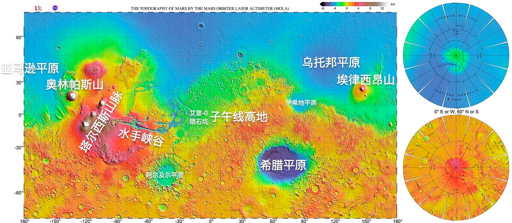
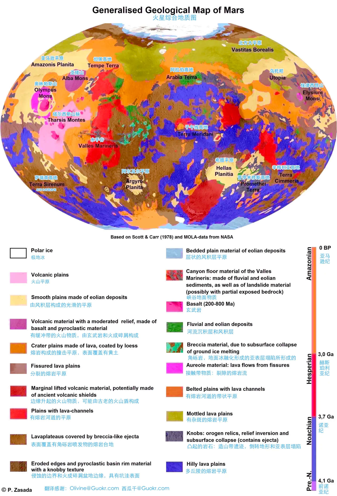
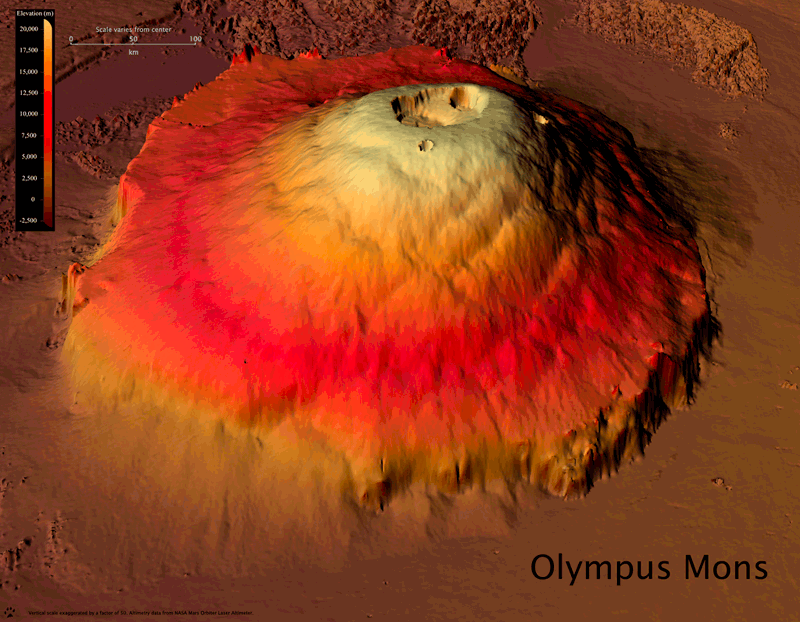
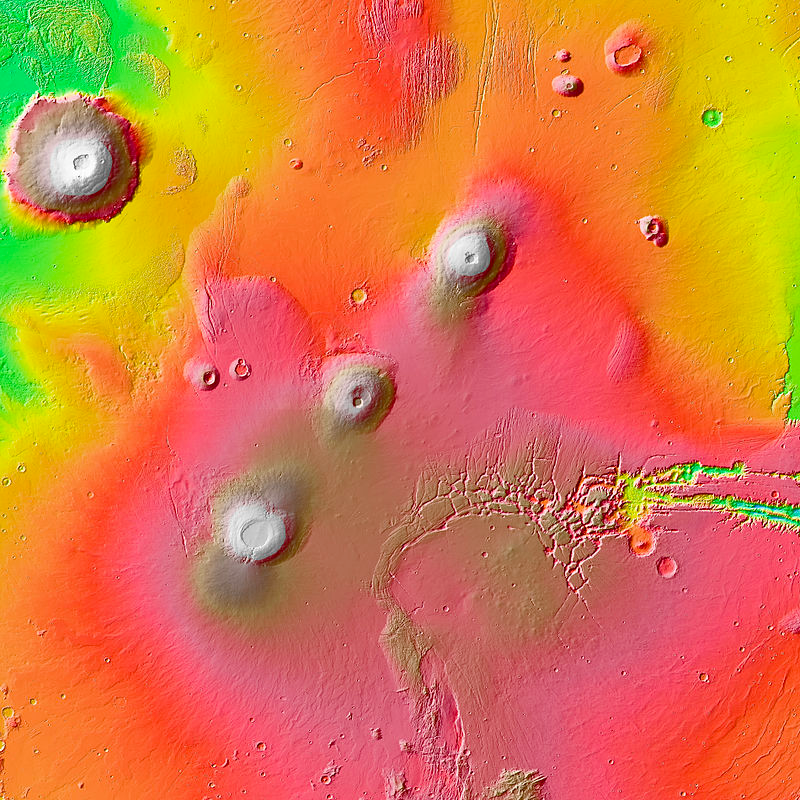
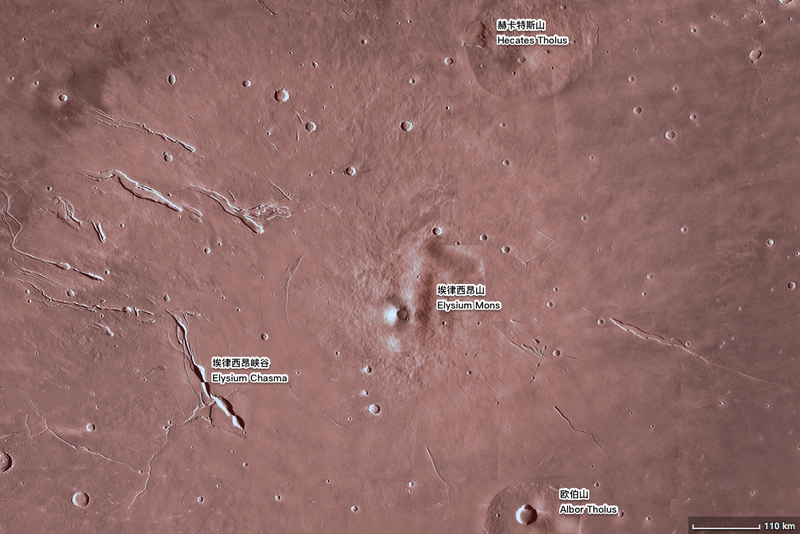
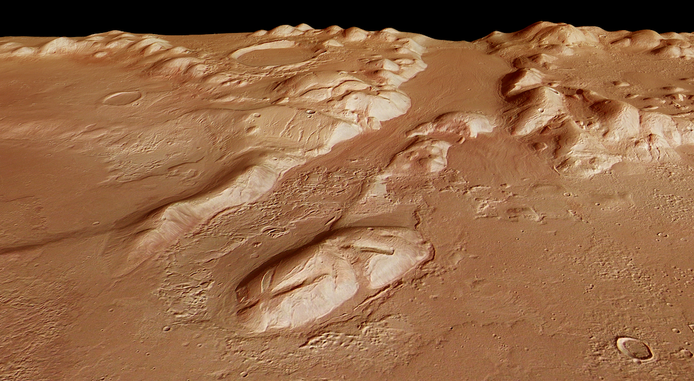
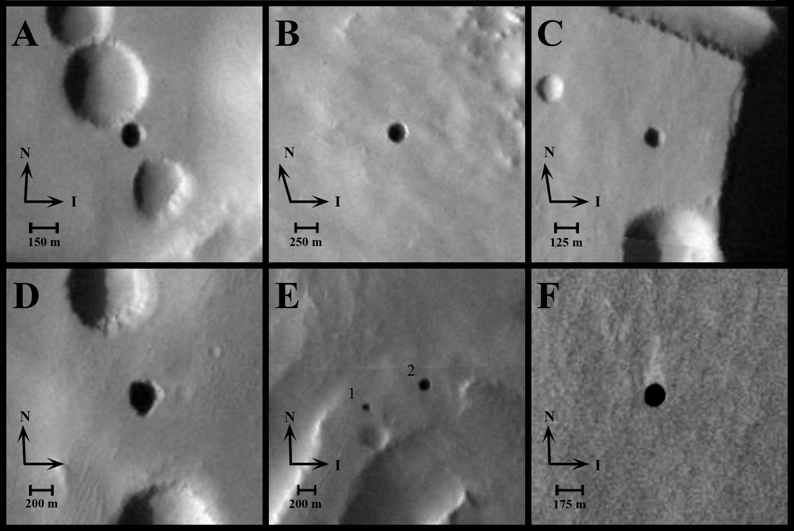
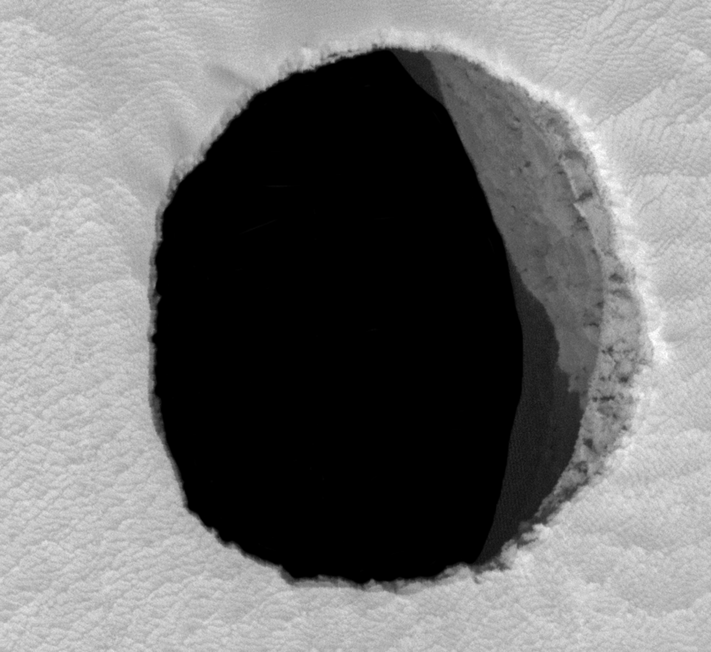
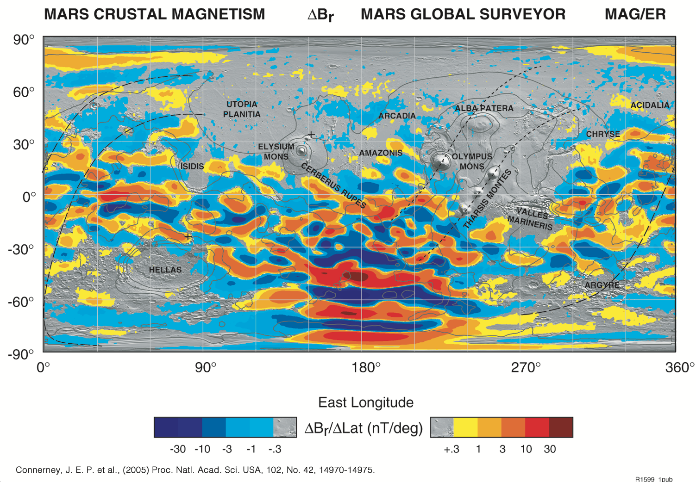
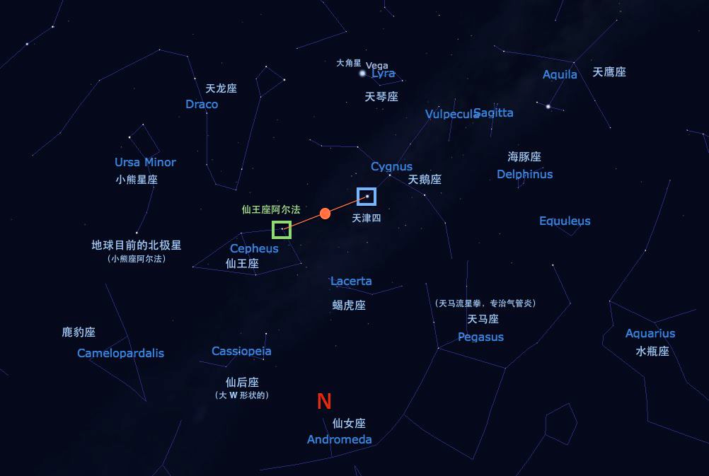

# 火星地理

=== "火星地图"

    

    来源：https://en.wikipedia.org/wiki/Mars

=== "火星综合地质图"

    

    由 @星际移民中心 翻译自 Wikipedia 。按照原图片的要求，翻译之后图片使用 Creative Commons Attribution-Share Alike 3.0 Unported 协议共享。原作者为 Patrick Zasada 。

=== "火星地图工具列表"

    - [NASA Trek](https://trek.nasa.gov/mars/#v=0.1&x=2.842170943040401e-14&y=0&z=1&p=urn%3Aogc%3Adef%3Acrs%3AEPSG%3A%3A104905&d=&locale=&b=mars&e=-253.12499527831594%2C-139.921872389958%2C253.124995278316%2C139.921872389958&sfz=&w=)
    - [Google Mars](https://www.google.com/mars/)
    - [Wikipedia Geography of Mars](https://en.wikipedia.org/wiki/Areography_(geography_of_Mars))
    - [Mars Express Map](https://www.esa.int/Science_Exploration/Space_Science/Mapping_Mars)
    - [HiRISE 的火星高清照片](https://www.uahirise.org/hiwish/browse)

## 火星上有趣的地理位置

=== "奥林帕斯山"

    奥林帕斯山—火星最高的山，太阳系第二高峰

    === "奥林帕斯山庞大无比"

        

        来源：HiRISE Mars Digital Elevation Models: Difficult to Build, Easy on the Eye. In: astroengine.com [Internet]. 31 Dec 2008 [cited 15 Jan 2023]. Available: https://astroengine.com/2008/12/31/hirise-digital-elevation-models-difficult-to-build-easy-on-the-eye/#jp-carousel-2874

    === "位置"

        

        来源：Olympus Mons. (2022, November 27). In Wikipedia. https://en.wikipedia.org/wiki/Olympus_Mons

=== "塔尔西斯山火山群"

    

    来源：Tharsis Montes. (2022, May 21). In Wikipedia. https://en.wikipedia.org/wiki/Tharsis_Montes

=== "水手峡谷"

    从火星高空看，水手峡谷赫然横在火星北半球，就像火星的一道疤痕。

    

    来源：NASA/JPL-Caltech

=== "埃律西昂山"

    

    来源：NASA/JPL

=== "佛勒格拉山系"

    该山系长达 1,352.0 公里，甚为壮观。

    

    来源：https://en.wikipedia.org/wiki/Phlegra_Montes#/media/File:Phlegra_Montes_in_perspective_ESA233303.tiff

=== "希腊盆地"

    

    来源：Hellas Planitia. (2022, May 22). In Wikipedia. https://en.wikipedia.org/wiki/Hellas_Planitia

## 火星上的洞穴

火星上存在很多的洞穴[^usgs-caves-mars][^usgs-marscavecatalog]。

=== "Arsia Mons 的洞穴"

    

    例如 Arsia Mons 东北方向的一个洞穴，至少要有 178 米[^hirise-arsia-mons-pit]。

    

## 火星磁场

火星本身没有活动核心带来的磁场，但是火星表面有一些剩余磁场，尤其是南半球有约 $22 \mathrm{nT}$ 的磁场。作为对比，地球的磁场大约在 $25 \sim 65 \mathrm{\mu T}$，也就是说地球磁场要高于火星约 1000 倍。

??? note "火星磁场地图"

    

    来源：NASA. In: New Map Provides More Evidence Mars Once Like Earth [Internet]. [cited 15 Jan 2023]. Available: https://www.nasa.gov/centers/goddard/news/topstory/2005/mgs_plates.html

## 火星星空

在火星上利用星空找到北极。

## 火星卫星

只要没有尘暴，日夜都可以清楚看到两颗火卫，野外迷路可以用来导航，并估计自己的经纬度。

## 扩展阅读

星际移民中心写过[一篇有趣的火星生存指南](https://zhuanlan.zhihu.com/p/20364302)。

[^usgs-caves-mars]: The Caves of Mars. In: U.S. Geological Survey [Internet]. [cited 15 Jan 2023]. Available: https://www.usgs.gov/news/caves-mars
[^usgs-marscavecatalog]: Mars Global Cave Candidate Catalog (MGC^3) v1 Cushing. In: USGS Astrogeology Science Center [Internet]. [cited 15 Jan 2023]. Available: https://astrogeology.usgs.gov/search/map/Mars/MarsCaveCatalog/mars_cave_catalog
[^hirise-arsia-mons-pit]: HiRISE. In: New View of Dark Pit on Arsia Mons (PSP_004847_1745) [Internet]. [cited 15 Jan 2023]. Available: https://hirise.lpl.arizona.edu/PSP_004847_1745

