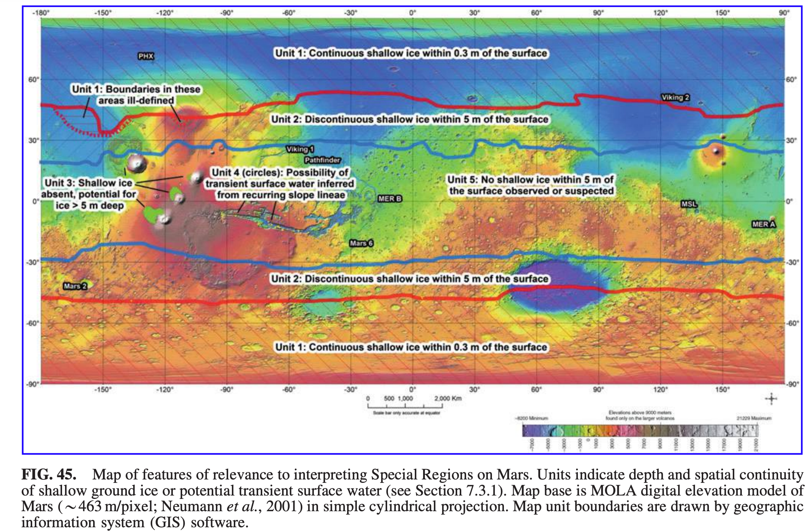
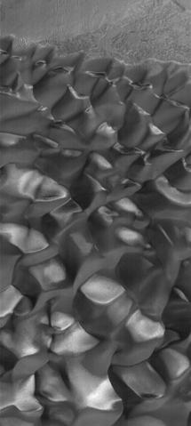
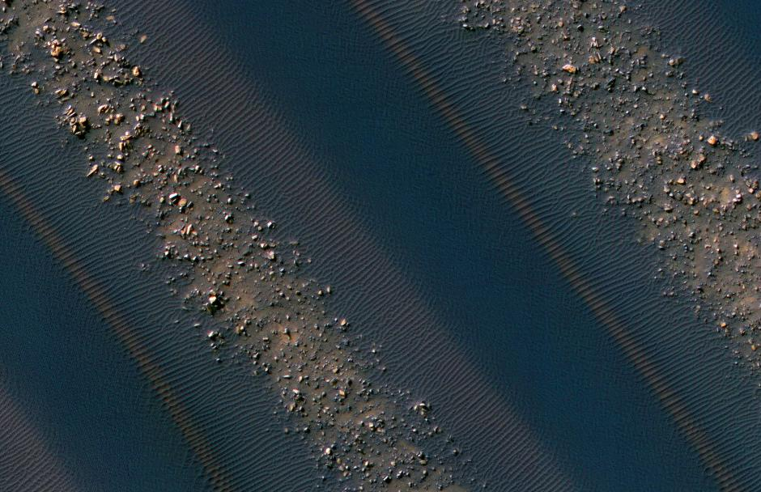

# 火星自然资源

## 水

火星上有水资源[@Rummel2014-kb]。

例如火星上出现了季节性流，这些变化可能是卤水流动造成的[^mars-seasonal-flow]。

.gif)

## 矿产资源

火星发生过水文和火山过程，可以产生聚集的矿脉。

=== "玄武岩沙堆"

    火星上有大量的[玄武岩](https://zh.wikipedia.org/wiki/%E7%8E%84%E6%AD%A6%E5%B2%A9)沙堆。下面的照片可以看到这些沙丘非常独特。

    ??? note "黑沙丘"

        

        Ore resources on Mars. (2022, July 18). In Wikipedia. https://en.wikipedia.org/wiki/Ore_resources_on_Mars

    ??? note "黑沙丘细节"

        

        Ore resources on Mars. (2022, July 18). In Wikipedia. https://en.wikipedia.org/wiki/Ore_resources_on_Mars

    玄武岩是非常好的矿产：

    - 铬铁矿（chromite）->铬矿石+铬化合物（三氧化二铬、重铬酸钠、重铬酸钾）,
    - 磁铁矿（magnetite）-> 炼铁,
    - 钛铁矿（ilmenite）-> 钛+二氧化钛（油漆、印刷油墨、织物、塑料、纸张、防晒霜、食品和化妆品）
    - 建筑物的基石或地基
    - 岩棉（良好的隔热材料）

=== "氘"

    火星上的氘的密集程度（0.1%）要比地球（0.016%）高[^marspedia-deuterium]。原因可能是因为氢与氘的逃逸程度不同[@Owen1988-ma]。

=== "丰富的金属元素"

    火星的表岩屑含有很多有用的元素，例如镍，钛，铁，硫，铝，硅，铜等等[@Moses2016-ly]。

[^marspedia-deuterium]: Deuterium. In: Marspedia [Internet]. [cited 15 Jan 2023]. Available: https://marspedia.org/Deuterium
[^mars-seasonal-flow]: 火星暖坡上的季节性流. (2022, January 12). In Wikipedia. https://zh.wikipedia.org/wiki/%E7%81%AB%E6%98%9F%E6%9A%96%E5%9D%A1%E4%B8%8A%E7%9A%84%E5%AD%A3%E8%8A%82%E6%80%A7%E6%B5%81

