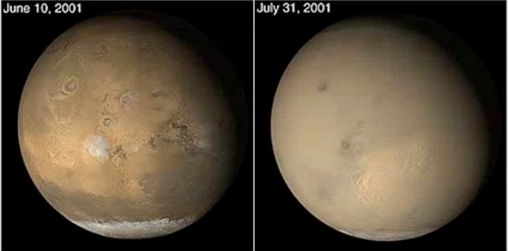
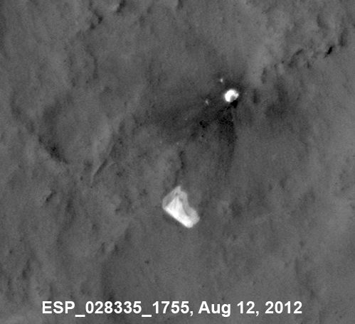
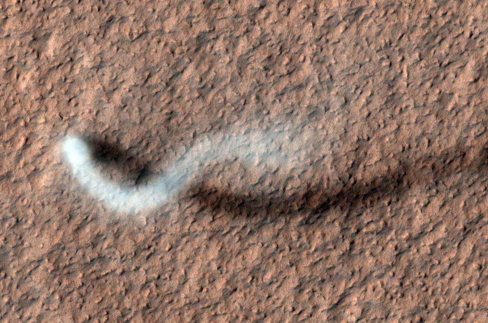
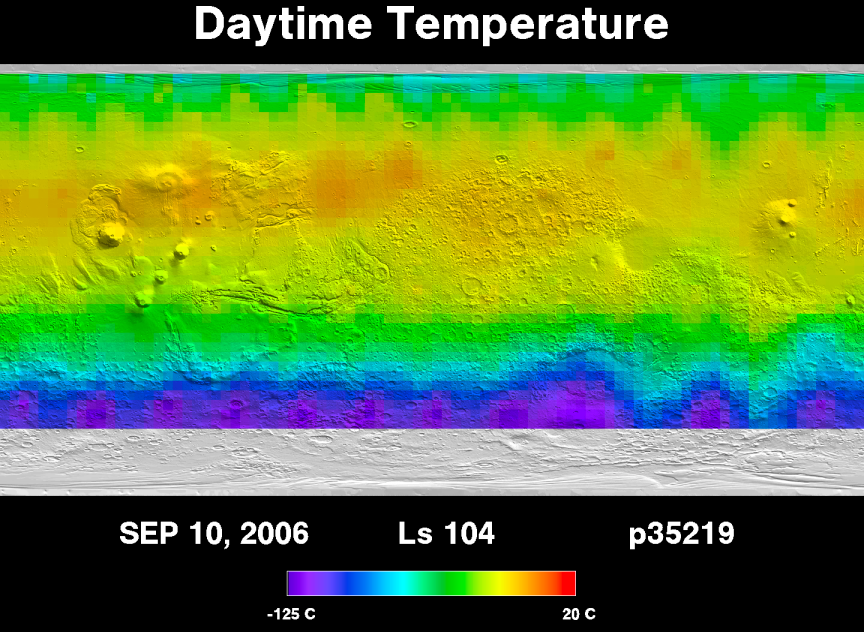
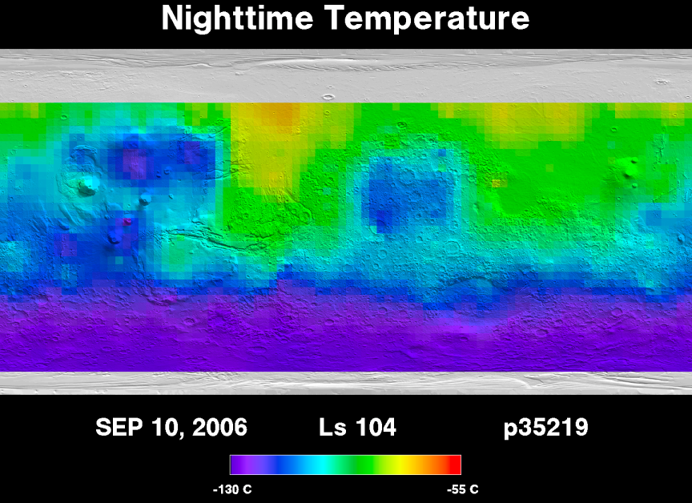
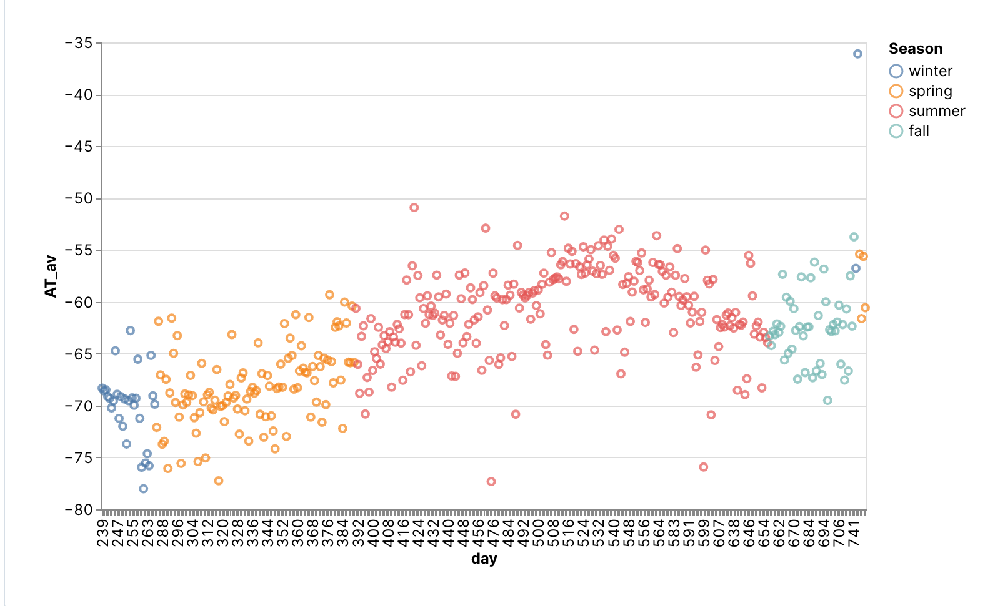

# 火星天气与气候

## 火星上的风与沙尘暴

火星表面的热惯量 （thermal inertia） 很低，很容易被加热。同时火星表面有的区域的热惯量高，有的区域低，所以会形成类似地球的[海陆风](https://en.wikipedia.org/wiki/Sea_breeze)。

火星风速虽然会很高，但由于气压不高，危害不是很大。不过其所带来的沙尘暴给火星的工程带来一些挑战[^nasa-martian-dust-storms]：

1. 沙尘会覆盖太阳能电池板，降低太阳能效率；
2. 沙尘进入机械装置内部。

不过归根结底，沙尘暴的最终动力也是太阳能，所以如果沙尘暴导致阳光无法抵达表面，沙尘暴本身也会降低。

=== "火星上的沙尘暴覆盖"

    

    来源：[Dust Storms of 2001](https://mars.nasa.gov/resources/7886/dust-storms-of-2001/), Credit: NASA/JPL-Caltech/Malin Space Sciences Systems

=== "火星上的风吹动降落伞"

    [HiRISE](https://hirise.lpl.arizona.edu/) 拍到的[好奇号](https://mars.nasa.gov/msl/home/)的降落伞形态变化的照片。

    

    来源: [PIA16813: MSL's Parachute Flapping in the Wind](https://photojournal.jpl.nasa.gov/catalog/PIA16813), Credit: NASA/JPL-Caltech/Univ. of Arizona

=== "火星上的龙卷风"

    [HiRISE](https://hirise.lpl.arizona.edu/) 拍到的火星上的龙卷风，发生地点是亚马逊平原。

    

    来源：[The Serpent Dust Devil of Mars](https://mars.nasa.gov/resources/5307/the-serpent-dust-devil-of-mars/), Credit: NASA/JPL-Caltech/University of Arizona

## 火星表面气温

火星表面昼夜温差很大，季节差异也很大[@Hargitai2010-hr]。

=== "白天气温分布"

    火星上白天的平均气温在太阳直射区域附近，甚至可以达到 20 摄氏度[^tes-temperture]

    

=== "夜晚气温分布"

    火星上夜间的平均气温[^tes-temperture]

    

=== "火星 Elysium Planitia 温度历史"

    NASA 有几个火星探测器设置了天气“预报”页面，例如
    - [Perseverance at Jezero Crater](https://mars.nasa.gov/mars2020/weather/),
    - [Curiosity at Gale Crater](https://mars.nasa.gov/msl/weather/),
    - [Insight at Elysium Plaitia](https://mars.nasa.gov/insight/weather/).

    星际移民中心收集了 Insight 探测器，也就是在 [Elysium Planitia](https://zh.wikipedia.org/wiki/%E5%9F%83%E5%BE%8B%E8%A5%BF%E6%98%82%E5%B9%B3%E5%8E%9F) 附近的温度数据。

    

    来源：自制，[代码在此](https://deepnote.com/@lm/InterImm-Mars-Weather-3bedb077-3beb-4d95-9880-c580ff14710c)

[^nasa-martian-dust-storms]: Hille K. The Fact and Fiction of Martian Dust Storms. In: NASA [Internet]. 18 Sep 2015 [cited 15 Jan 2023]. Available: https://www.nasa.gov/feature/goddard/the-fact-and-fiction-of-martian-dust-storms

[^tes-temperture]: Thermal Emission Spectrometer. In: Mars Global Surveyor - Thermal Emission Spectrometer [Internet]. [cited 15 Jan 2023]. Available: http://tes.asu.edu/

